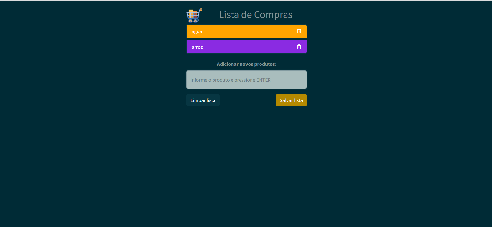

<h1 align="center">  Shopping List </h1>

Projeto para armazenar uma lista de compras.  

  <a href="#-tecnologias">Tecnologias</a>&nbsp;&nbsp;&nbsp;|&nbsp;&nbsp;&nbsp;
  <a href="#-projeto">Projeto</a>&nbsp;&nbsp;&nbsp;|&nbsp;&nbsp;&nbsp;

 

  

## 🚀 Tecnologias

Esse projeto foi desenvolvido com as seguintes tecnologias:

- HTML e CSS
- JavaScript
- Bootstrap
- Git e Github

## 💻 Projeto

O Shopping List é um projeto de lista de comprs para armezenar o que precisa ser comprado.

- [Acesse o projeto finalizado, online](https://gabicavalheiro.github.io/shopping-list/)

